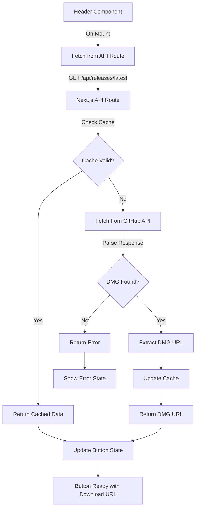

# GitHub Releases API Integration Plan

## Overview

Integrate the GitHub Releases API to dynamically fetch the latest DMG download URL from `https://api.github.com/repos/Adithya0128/aitea/releases/latest` and update the download button in the Header component. The implementation uses a Next.js API route for server-side fetching to avoid GitHub rate limits.

## Architecture



## Implementation Steps

### 1. Create GitHub API Service Function

**File:** `text-enhancer/lib/github-api.ts`

Create a utility function to:

- Fetch from GitHub API endpoint
- Parse JSON response
- Find `.dmg` asset in the `assets` array
- Return structured data: `{ url: string, filename: string, version: string } | null`
- Handle errors gracefully with try-catch

### 2. Create Next.js API Route

**File:** `text-enhancer/app/api/releases/latest/route.ts`

Implement server-side API route that:

- Calls the GitHub API service function
- Implements server-side caching using in-memory cache (5-10 minute TTL)
- Returns JSON response with DMG URL or error
- Handles CORS if needed
- Returns appropriate HTTP status codes (200, 404, 500)

**Response format:**

```typescript
// Success
{ success: true, url: string, filename: string, version: string }

// Error
{ success: false, error: string }
```

### 3. Update Header Component

**File:** `text-enhancer/components/Header.tsx`

Modify the download button to:

- Add state management for loading, error, and download URL
- Fetch from `/api/releases/latest` on component mount using `useEffect`
- Implement client-side caching using `sessionStorage` (5-10 minutes)
- Update button `href` dynamically when URL is fetched
- Show loading state: disable button, show "Loading download..."
- Show error state: disable button, show "Download unavailable"
- Show success state: enable button with working download link
- Handle both desktop and mobile menu buttons

**State structure:**

```typescript
const [downloadState, setDownloadState] = useState<{
  loading: boolean;
  url: string | null;
  error: string | null;
}>({ loading: true, url: null, error: null });
```

### 4. Add Type Definitions

**File:** `text-enhancer/lib/types.ts` (create if doesn't exist)

Define TypeScript interfaces for:

- GitHub API response structure
- Release asset structure
- API route response structure

### 5. Error Handling Strategy

- Network errors: Show "Download unavailable" message
- API errors (404, 403, 500): Log error and show user-friendly message
- No DMG asset found: Show "Download unavailable" message
- Invalid response format: Log error and show fallback message
- All errors should be logged to console for debugging

### 6. Caching Implementation

**Server-side (API route):**

- In-memory cache with timestamp
- Cache key: `latest_release`
- Cache duration: 10 minutes
- Check cache before making GitHub API call

**Client-side (Header component):**

- Use `sessionStorage` for browser-level caching
- Cache key: `tealai_latest_release`
- Cache duration: 10 minutes
- Check cache before API call
- Update cache after successful fetch

## Files to Create/Modify

### New Files

1. `text-enhancer/lib/github-api.ts` - GitHub API service function
2. `text-enhancer/app/api/releases/latest/route.ts` - Next.js API route
3. `text-enhancer/lib/types.ts` - TypeScript type definitions (if doesn't exist)

### Modified Files

1. `text-enhancer/components/Header.tsx` - Update download button with dynamic URL fetching

## Implementation Details

### GitHub API Service Function

- Use native `fetch()` API
- Parse `assets` array to find file ending with `.dmg`
- Extract `browser_download_url`, `name`, and release `tag_name`
- Return null on any error

### API Route Handler

- Export `GET` function for Next.js App Router
- Implement simple in-memory cache with Map
- Call GitHub API service function
- Return JSON response with proper headers

### Header Component Updates

- Add `useEffect` hook to fetch on mount
- Check `sessionStorage` cache first
- Update both desktop and mobile download buttons
- Maintain existing button styling and animations
- Preserve existing button behavior (hover, tap animations)

## Testing Considerations

- Test successful API call and button update
- Test network failure handling
- Test cache behavior (first load vs cached load)
- Test when no DMG asset is available
- Test rapid component remounts (prevent duplicate calls)
- Verify both desktop and mobile buttons update correctly

## Expected Behavior

1. Page loads → Button shows "Loading download..." (disabled)
2. API call succeeds → Button updates with DMG URL and becomes clickable
3. User clicks → Downloads latest DMG file from GitHub
4. On refresh → Uses cache if available (faster response)
5. On error → Button shows "Download unavailable" (disabled)

## Rate Limit Considerations

- Server-side implementation avoids client-side rate limits
- In-memory cache reduces GitHub API calls
- Client-side cache reduces API route calls
- Estimated: ~6 API calls per hour per user (one per 10-minute cache window)